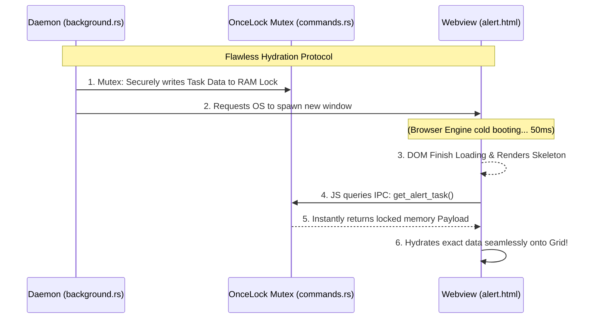

# 🏗️ Architecture & Codebase Design Document

Welcome to the Rust Productivity App! This document is explicitly designed to help incoming engineers construct a mental model of the entire repository. It covers the technical justifications for our stack, architectural diagrams, and a sequential "Flow of Thinking" guide detailing exactly how to trace and build upon this codebase.

---

## 1. System Overview & Technology Stack

The application strictly utilizes a robust **Rust Core** interwoven with a minimal **Vanilla Web Frontend**.

- **Tauri v2:** We chose Tauri over Electron or Iced/GTK to resolve heavy cross-platform rendering bugs. Tauri provides lightning-fast computational performance, OS-level primitives, and dynamically spawns transparent bordering native OS Webviews with an infinitely smaller compiled binary size.
- **SQLite (`rusqlite`):** Used over raw JSON for ACID compliance, scalable relational querying, and rigorous read-safety without massively bloating heap memory limits.
- **Vanilla HTML/JS/CSS:** Bypasses massive NPM bundlers (React/Next.js) resulting in absolute zero supply-chain vulnerabilities, eliminating Node.js execution layers, and minimizing cold boot times strictly to OS HTML parsing speeds.

---

## 2. 🧠 Developer Thinking Flow: Where to Start?
*If you are new to the codebase, **do not read the files alphabetically**! Follow this sequential Flow of Thinking to trace how data geometrically moves through the application.*

1. **Start at `src/models.rs` (The Foundation)**
   Everything begins with Data. Read this file first to understand the structural primitive `Task`. We define the fields (Title, Priority, Due Date) here so the rest of the application has a universal blueprint.
2. **Move to `src/database.rs` (The Persistence)**
   Once you know the shape of the data, read how we permanently save it. This file is the Data Access Object (DAO), abstracting raw SQL queries (`INSERT`, `SELECT`, `UPDATE`).
3. **Trace to `src/commands.rs` (The Bridge)**
   Now that we can save Data, how does the User Interface trigger it? `commands.rs` acts as the API Router (IPC). It defines the `#[tauri::command]` functions that wire the Frontend Javascript requests explicitly into the Database functions from Step 2.
4. **Examine `ui/app.js` & `ui/index.html` (The Visuals)**
   The Frontend explicitly awaits the commands mapped in Step 3 `invoke('get_tasks')`. It loops through the Rust data array and actively injects HTML nodes onto the screen for the user.
5. **Finish at `src/background.rs` (The Silent Worker)**
   This runs parallel to EVERYTHING else. It is an infinite loop that ignores the main UI, quietly polling `database.rs` to find overdue tasks, and forcefully waking up the Alarm Window (`ui/alert.html`) when necessary.

---

## 3. 📊 High-Level System Architecture

```mermaid
graph TD
    subgraph Frontend [UI Layer - Vanilla JS/HTML]
        UI[Main Window: index.html]
        Alert[Alarm Overlay: alert.html]
    end

    subgraph IPC [Tauri Inter-Process Communication]
        Cmd[src/commands.rs / invoke()]
    end

    subgraph Backend [Rust Core Ecosystem]
        Model[src/models.rs]
        DB[src/database.rs]
        Daemon[src/background.rs / OS Thread]
    end

    subgraph Storage
        SQLite[(SQLite: tasks.db)]
    end

    UI <-->|JSON Commands| Cmd
    Cmd <--> Model
    Cmd <-->|Read / Write| DB
    DB <--> SQLite
    
    Daemon -.->|Polls every 60s| DB
    Daemon ===>|Triggers Overlay UI| Alert
    Alert -.->|Fetches payload| Cmd
```

---

## 4. Deep Dive: Key File Mechanics

Here are the intricate details regarding why specific engineering decisions act as they do over the codebase.

### `src/database.rs` (Data Mapping & Time Resilience)
**The Problem:** SQLite does not natively understand ISO datetimes—it assesses them as raw lexical strings. Because space separators evaluate mathematically lower than the rigorous ISO `T` delimiter (`2026-07-29T...`), the database conditionally evaluated arbitrary future dates as validly past the current boundary!
**The Implementation:** We actively stripped out implicit SQLite date equations. Look closely at `fetch_unnotified_overdue_tasks()`. The framework now bulk-fetches all pending objects into native Rust memory and computes the comparisons strictly via **RAM-based `chrono::Utc` mathematics (`t.due_date <= Utc::now()`)**, ensuring strict timezone-agnostic mathematics that literally cannot fail.

### `src/background.rs` (The Daemon Execution)
Look closely at `std::thread::spawn(move || { loop { ... } })`.
- **Why a Loop?**: It serves as a continuous algorithmic heartbeat (`thread::sleep(Duration::from_secs(60))`), polling the RAM pool indefinitely.
- **Why spawn a new OS Thread?**: Because it executes *outside* the Main Tauri process boundary. Even if the graphical Webview stutters, or the user actively closes the Main Window into the System tray, the daemon thread persists flawlessly in memory. The alarm fires synchronously no matter the state of the GUI.

---

## 5. The Alarm Window Race-Condition (IPC Data Lock)

Creating a popup that loads data dynamically creates a severe Asynchronous Race Condition.



**The Mitigation Explained:**
Originally, Rust attempted to `.emit()` task data dynamically to the newly spawned window simultaneously. However, WebView spin-up latency resulted in the JavaScript DOM simply missing the event.
To eliminate this, we established a `OnceLock<Mutex<Option<Task>>>` envelope in `src/commands.rs`:
- Rust calculates the overdue payload and securely wraps it natively into the immutable atomic memory lock *before* triggering the window boot.
- The Javascript DOM boots naturally. Once fully stabilized, it natively queries Rust via the IPC (`invoke('get_alert_task')`) to extract its payload. This fundamentally decouples the rendering execution, preventing all `Loading...` skeleton bugs without throwing arbitrary wait timers!

---

## 6. Native Windowing API (`WebviewWindowBuilder`)

The visual identity of this productivity suite hinges on its transparent overlay protocol.
When `background.rs` decides an alarm must sound, it configures:
- `decorations(false) & transparent(true)`: Renders an invisible HTML border masking smoothly onto the user's desktop hardware visually.
- `always_on_top(true)`: Forces maximum Z-index priority (overlapping intense games and workflows).
- **Recycling Protocol:** Before calling `Builder`, Tauri checks `if let Some(existing) = app.get_webview_window("alert")`. If a user triggers a second alarm while the first is visibly open, Tauri prevents a window-label compilation panic, and purely interpolates the second payload natively into the existing live pane immediately.

## 7. Enterprise Refactoring: Connection Pooling & Dependency Injection

### The Historical Context
**Original Implementation:** Initially, every time a UI method executed an IPC command (e.g., `get_tasks`), the backend manually invoked `Database::new("tasks.db")`.
- **Pros:** Incredibly simple prototyping workflow. Inherently bypasses the extremely steep Rust thread and lifetime boundary learning curves. Prevents context sharing.
- **Cons:** Under industrial data-limits, spawning a physical Disk File Stream on every UI click generates a massive I/O bottleneck. It heavily risks triggering the destructive SQLite `database is locked` error and permanently exhausts arbitrary OS-level file handles.

### The Enterprise Transition
**The Refactored Implementation:** We migrated the native layer to a **Thread-Safe Singleton Connection**. `main.rs` structurally initializes exactly *one* connection at application boot. It natively wraps the database into a secure `Arc<Mutex<Database>>`. This single memory footprint is seamlessly cloned synchronously into the Background Daemon sequence, and dynamically bound into Tauri's native IPC State engine natively utilizing `.manage(db)`. 
- **Pros:** Obliterates all Disk I/O latencies. SQLite executes on pure RAM cache speed without ever having to reload the internal buffer pool frame! Absolute cross-thread lock safety mapping flawless transactions implicitly.
- **Cons:** Considerably steepens the application's architectural complexity. Requires strict pattern-matching `Result` propagation networks to mathematically prevent `Mutex` logic poisoning from cascading into fatal core engine panics.

#### Research Keywords & Further Study
To thoroughly comprehend how we achieved this massive performance optimization without breaking the UI flow, please Google/research the following structural Rust patterns:
- **Tauri State Management (`tauri::State`)**: Forms the Dependency Injection (DI) container algorithm explicitly mapping variables natively into frontend hook parameters.
- **Atomic Reference Counting (`Arc<T>`)**: Rust's standard primitive allowing heavily isolated background threads to simultaneously point linearly to identical heap block data securely bridging lifespans.
- **Thread Poisoning & `OnceLock<Mutex>`**: Defining precisely why arbitrarily mapping `.unwrap()` algorithms across asynchronous boundaries inevitably forces core stack corruptions.
